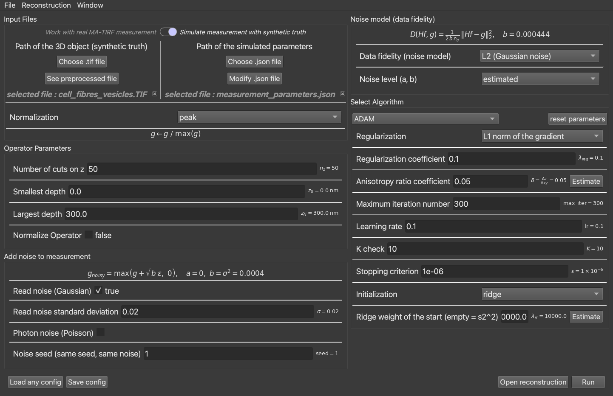
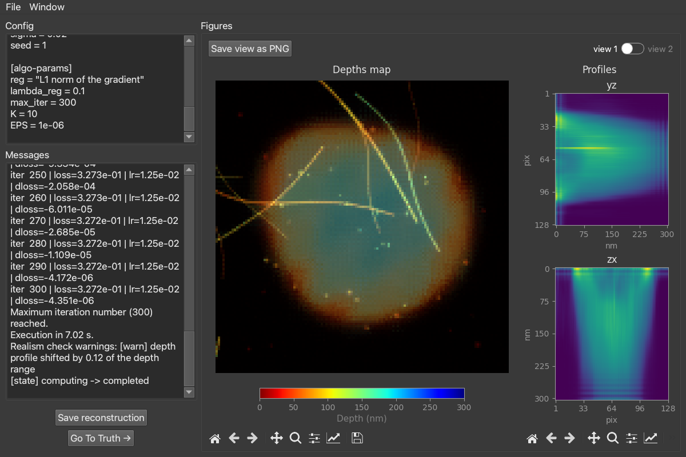
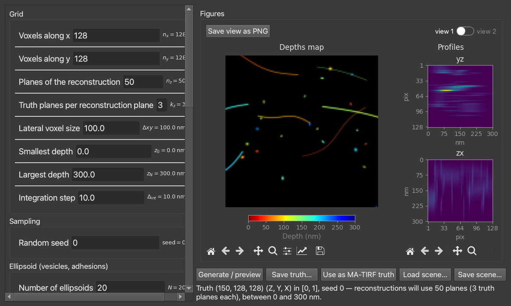

# User tutorial

A hands-on walk-through of `matirf_python_plus`: run your first reconstruction, work with real
and synthetic data, read the results, and drive it headless. For installation see the
[README](../README.md); for the theory and per-algorithm guidance see
[docs/algorithms/](algorithms/).

> The screenshots use the default **dark theme** (`settings.toml`: `dark_style = true`,
> `app_style = "fusion"`). Yours will match your settings.

---

## 1. What the tool does

It reconstructs an unknown object **f** from a measurement **g** and a known forward operator
**H**, by minimising `(1 − λ)·D(Hf, g) + λ·R(f)` under `f ≥ 0`. Two inverse problems ship with
it — **matirf** (3D MA-TIRF depth reconstruction) and **deconv** (2D deconvolution) — and each
can be solved with several algorithms. Every command below works for both problems: just swap
`matirf` for `deconv`.

---

## 2. Your first reconstruction (GUI)

```bash
matirf gui
```

This opens the **control window**, where you choose the inputs, the operator, the noise model
and the algorithm, then press **Run**.



Work top to bottom:

1. **Input Files.** Toggle between *real* measurement and *synthetic* (simulate from a known
   truth — see §4). Pick the `.tif` (the object, or the measurement) and the `.json`
   (microscope parameters). **Normalization** sets the unit every noise level and the data term
   are expressed in (`peak` is the default).
2. **Operator Parameters.** The depth grid: number of planes `nz`, and the depth range
   `z0`–`zN` (nm). Leave **Normalize Operator** off for MA-TIRF.
3. **Add noise to measurement** *(synthetic only).* Add Gaussian and/or Poisson noise with a
   fixed seed, to test robustness on data whose clean answer you know.
4. **Noise model (data fidelity).** The likelihood `D` — Gaussian, Poisson or Poisson-Gaussian.
   *estimated* reads the noise from `g`; *oracle* uses the exact level you injected.
5. **Select Algorithm.** Pick the solver (ADAM, PPXA, ADMM, PnP, ADMM-PnP, MCMC) and its
   parameters. The panel adapts to the solver; **reset parameters** restores its defaults, and
   **Estimate** buttons compute data-driven values (e.g. the anisotropy ratio, the ridge
   weight). See [docs/algorithms/](algorithms/) for what each parameter does.

Then **Run** (bottom right). **Save config** writes the current setup to a `.toml`;
**Load any config** restores one; **Open reconstruction** re-opens a saved result.

---

## 3. Reading the results

Running opens the **display window**:



- **Config** and **Messages** (left): the exact setup, the iteration log, the runtime, and the
  realism check's verdict (here a mild depth-shift warning).
- **Depths map** (centre): each lateral pixel coloured by the depth (nm) of its brightest voxel
  — the MA-TIRF answer, "how far from the glass".
- **Profiles** (right): `yz` and `zx` cross-sections through the volume.
- **view 1 / view 2** toggles between the depth view and the intensity/metrics view; in
  synthetic mode a metrics table compares the reconstruction to the truth.
- **Go To Truth** shows the known answer side by side (synthetic mode); **Save reconstruction**
  writes the volume, its config and metrics to a folder; **Save view as PNG** exports the figure.

---

## 4. Making synthetic test data

To compare algorithms on data whose exact answer is known, design a ground truth:

```bash
matirf synth
```



Set the grid and the structures (ellipsoids for vesicles, filaments, membranes, double layers),
**Generate / preview**, then either **Save truth…** (a `.tif` plus a `.truth.json` that
reproduces it) or **Use as MA-TIRF truth** to load it straight into the matirf config as the
synthetic object. **Save scene… / Load scene…** store the whole design as a reusable `.toml`.

---

## 5. Headless / batch (CLI)

Run a reconstruction with no interface, from a saved config:

```bash
matirf cli -c my_config.toml -o results/run-01
```

It prints progress and writes the reconstruction, its config and metrics into `results/run-01`.
This is the way to script many runs; the campaign in `benchmarks/` does exactly this at scale
(see [docs/benchmark/](benchmark/)).

---

## 6. Settings

```bash
settings show                 # list every setting and its value
settings set dark_style false # e.g. switch to the light theme
settings reset                # back to defaults
settings gui                  # edit them in a window
```

Useful ones: `dark_style` / `app_style` (appearance), `font_size_*`, `device`
(`cpu` / `cuda` / `mps`), `dtype`, and `live_preview` (refresh the figures during the run).

---

## 7. Housekeeping

- `matirf reset` deletes the cached `config.toml` (back to defaults).
- `list` shows the available inverse problems; `help` shows every command.
- A reconstruction saved from the GUI or CLI is a folder with `config.toml`, the volume, and
  `metrics.json` — re-run the config to reproduce it.

## Next steps

- **Choose and tune an algorithm:** the decision guide and per-algorithm notes in
  [docs/algorithms/](algorithms/).
- **Extend the framework:** the [developer guide](developer_guide.md) (adding an inverse problem,
  a solver, a metric).
