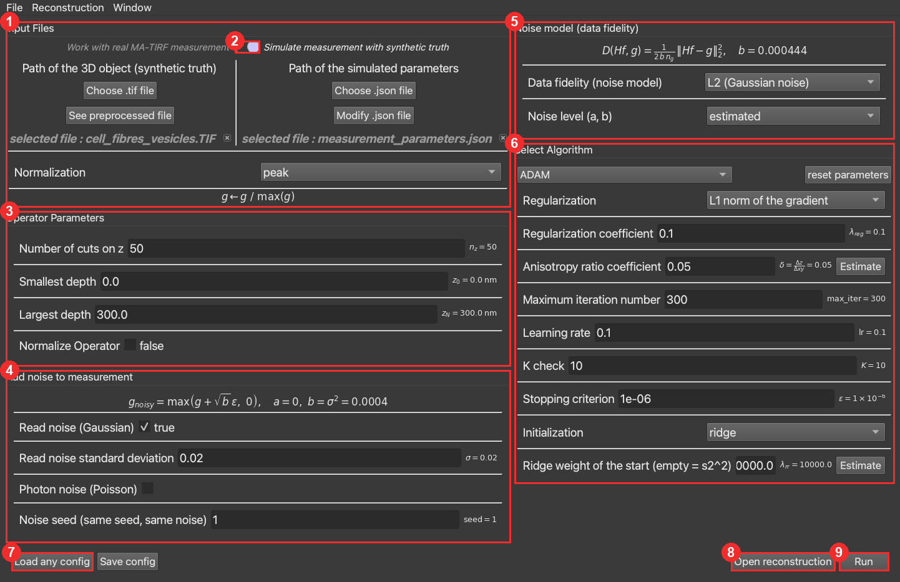
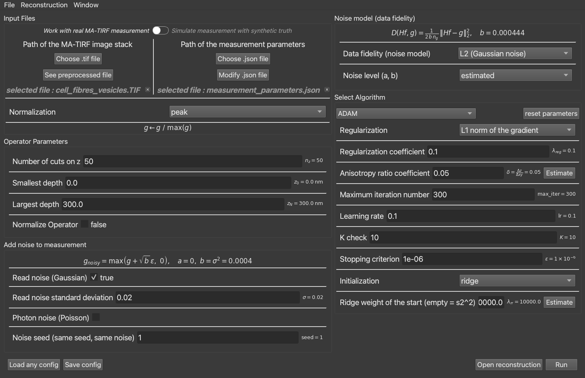
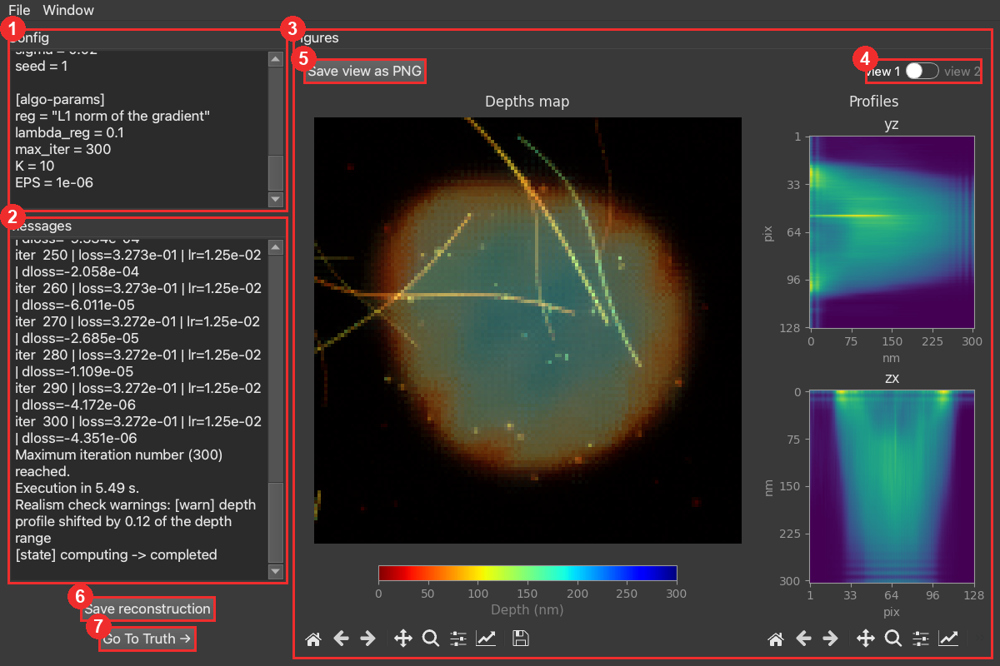
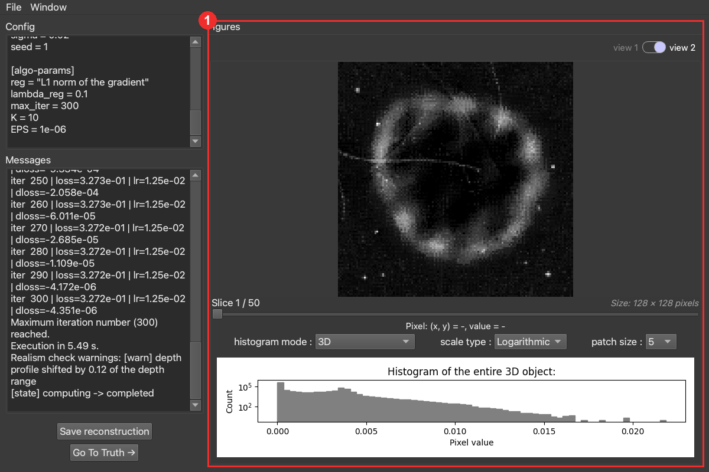
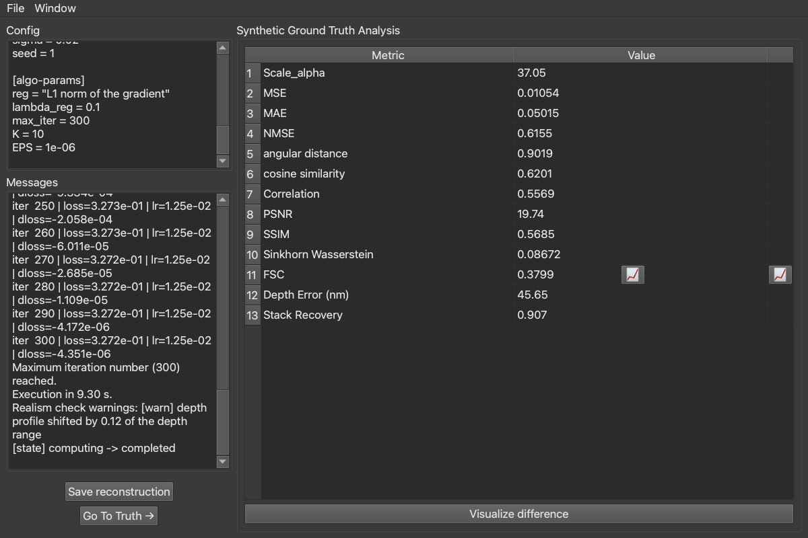
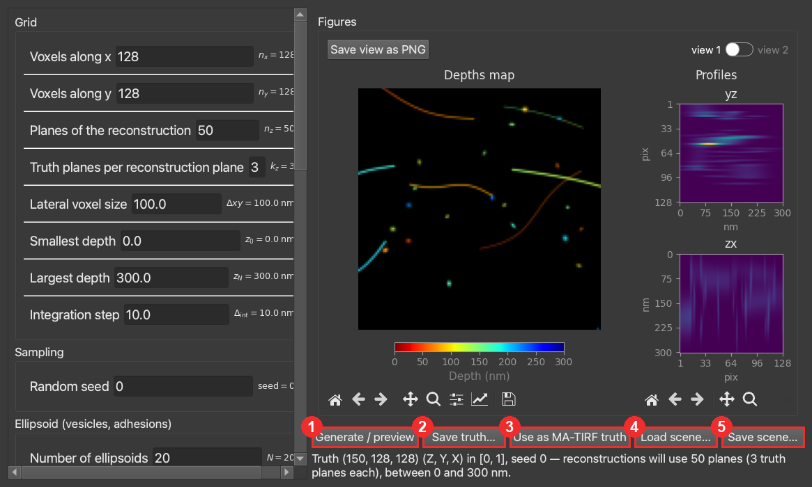

# User tutorial

A detailed, hands-on guide to `matirf_python_plus`: the two working modes, every control of the
GUI, the file types in and out, running a reconstruction, and reading the results against a
ground truth. For installation see the [README](../../README.md); for the theory and
per-algorithm guidance see [docs/algorithms/](../algorithms/).

> Screenshots use the default **dark theme** (`settings.toml`: `dark_style = true`,
> `app_style = "fusion"`). Yours match your own settings.

---

## 1. The idea, and the two modes

The tool reconstructs an unknown object **f** from a measurement **g** and a known forward
operator **H**, by minimising `(1 − λ)·D(Hf, g) + λ·R(f)` under `f ≥ 0`. Two inverse problems
ship with it — **matirf** (3D MA-TIRF depth reconstruction) and **deconv** (2D deconvolution).
Every command below works for both: swap `matirf` for `deconv`.

There are **two modes**, chosen by a toggle at the top of the control window:

- **Synthetic** — you provide a known object (a *ground truth* `f_true`); the tool simulates the
  measurement `g = H·f_true` (optionally adding noise), reconstructs, and **compares the result
  to the truth** (metrics, §6). Use this to test and tune algorithms on data whose exact answer
  you know.
- **Real** — you provide a real measurement `g`; the tool reconstructs `f`. There is no truth,
  so no error metrics — only the data-fit diagnostic and the visual result.

---

## 2. The control window

```bash
matirf gui
```



1. **Input Files.** The measurement (or, in synthetic mode, the object) and the microscope
   parameters. See the file types in §3. **See preprocessed file** shows `g` exactly as the
   reconstruction will see it. **Normalization** fixes the unit `g` (and therefore the noise
   level and the data term) is expressed in — `peak` (`g ← g/max g`) is the default.
2. **Mode toggle.** Switch between *real measurement* and *simulate from a synthetic truth* (§1).
   The Input Files labels and the availability of the noise-injection section follow it.
3. **Operator Parameters.** The depth grid H reconstructs on: number of planes `nz`, and the
   depth range `z0`–`zN` (nm). **Normalize Operator** stays *off* for MA-TIRF (it would divide H
   by its largest singular value; the physical operator is wanted). See
   [the algorithms reference](../reconstruction_algorithms.pdf).
4. **Add noise to measurement** *(synthetic only).* Inject Gaussian read noise and/or Poisson
   shot noise with a fixed **seed** (same seed → same noise, for reproducible comparisons). The
   formula shown is exactly what is applied.
5. **Noise model (data fidelity).** The likelihood `D` the reconstruction assumes — Gaussian
   (L2), Poisson, or Poisson-Gaussian. **Noise level (a, b)**: *estimated* reads it from `g`;
   *oracle* (synthetic only) uses the exact level you injected. The formula and the current
   `(a, b)` are shown live.
6. **Select Algorithm.** Pick the solver (ADAM, PPXA, ADMM, PnP, ADMM-PnP, MCMC); the parameter
   panel adapts to it. **reset parameters** restores its defaults. **Estimate** buttons compute
   data-driven values (here the anisotropy ratio δ, and the ridge start weight λ_rr). What each
   parameter does — and its useful range — is in [docs/algorithms/](../algorithms/).
7. **Load any config / Save config.** Read or write the whole setup as a `.toml` (§3).
8. **Open reconstruction.** Re-open a previously saved result in the display window.
9. **Run.** Start the reconstruction; the display window (§5) opens.

---

## 3. File types — input and output

**Inputs**

| file | what it is |
|---|---|
| `*.tif` / `*.TIF` | the 3D data — a synthetic **object** `f_true` (synthetic mode) or the **measurement** stack `g` (real mode). For deconv it is a `*.png` image. |
| `*.json` | the **microscope / measurement parameters** (angles, wavelength, refractive indices, NA…) that define the operator H. **Modify .json file** edits it in place. |
| `config.toml` | the **whole run** — inputs, operator, noise, algorithm and its parameters. This is what *Save config* writes and *cli* reads. |

A `config.toml` looks like this:

```toml
algorithm = "ADAM"

[input-paths]
mode = "synthetic-data"          # or "real-data"
tif  = ".../cell_fibres_vesicles.TIF"
json = ".../measurement_parameters.json"
normalization = "peak"

[oper-params]
nz = 50
z0 = 0.0
zN = 300.0
normalize = false

[add-noise]                      # synthetic only; empty {} for real data
gaussian_noise = true
sigma = 0.02
seed = 1

[noise-model]
parameters = "oracle"            # or "estimated"

[algo-params]
reg = "L1 norm of the gradient"  # the regulariser R
lambda_reg = 0.1                 # the regularisation share λ
max_iter = 3000
K = 10
EPS = 1e-6
```

**Outputs** — *Save reconstruction* (or `cli -o`) writes a folder:

| file | what it is |
|---|---|
| `config.toml` | the exact run (re-run it to reproduce) |
| `f.tif` (`f.png` for deconv) | the reconstruction |
| `f_true.tif` | the truth (synthetic mode) |
| `metrics.json` | the quality metrics (synthetic mode, §6) |
| `messages.txt` | the run log |

---

## 4. Real vs synthetic mode

Toggling to **real** changes the Input Files: you now point to your **measurement stack** (not a
truth) and its parameters, and the noise-injection section no longer applies (a real measurement
already carries its noise).



The rest is identical. The one consequence downstream: with no truth there is **no metrics
table** — only the data-fit diagnostic (`chi2_ratio`, which needs no truth) and the visual
result.

---

## 5. Running, and the display window

Pressing **Run** opens the display window. On the left, the **Config** (the exact setup) and the
**Messages** log (iterations, runtime, and the *realism check* verdict). On the right, the
figures — with a **view 1 / view 2** toggle.

### View 1 — the depth map



1. **Config** — the exact setup this result came from (the `config.toml`).
2. **Messages** — the iteration log, the execution time, and the realism check (here a mild
   *depth-shift* warning).
3. **Figures (view 1)** — the **Depths map** (each lateral pixel coloured by the depth, in nm,
   of its brightest voxel — the MA-TIRF answer, "how far from the glass"), and the **yz / zx
   profiles** (cross-sections through the volume). The matplotlib toolbars pan/zoom/save each.
4. **view 1 / view 2 toggle** — switch between the depth-map view (view 1, here) and the
   intensity + histogram view (view 2, below).
5. **Save view as PNG** — export this figure at a fixed size (used for the report figures).
6. **Save reconstruction** — write the output folder (§3).
7. **Go To Truth** — switch to the ground-truth comparison (§6). **Synthetic mode only** — in
   real mode there is no truth, so this button is absent.

### View 2 — intensity and histogram



View 2 shows the raw **intensity** of the reconstruction: a slice viewer (scroll through the
`nz` planes), the pixel read-out, and the **histogram of the whole volume**. Note the values sit
around `0–0.02` — on MA-TIRF `f` peaks near `0.02`, not `1` (this is why parameters "in units of
`f`" must be read on that scale; see [the algorithms reference](../reconstruction_algorithms.pdf)).

---

## 6. Metrics and ground-truth analysis

In synthetic mode, **Go To Truth** shows the **Synthetic Ground Truth Analysis** — every metric
comparing the reconstruction to the known `f_true`:



- **Scale_alpha** — the positive factor α that best matches `f` to the truth. MA-TIRF fixes `f`
  only up to such a factor (here α ≈ 37 ≈ s1), so every error metric is computed **after**
  aligning by α.
- **NMSE** — normalised mean-squared error (0 perfect, 1 = no better than zero). The workhorse.
- **PSNR / SSIM** — the familiar image-processing measures (PSNR in dB; SSIM structural).
- **Depth Error (nm)** — the axial-localisation error, **the** MA-TIRF question.
- **Stack Recovery** — the fraction of ≥ 30 nm-separated structure pairs the reconstruction also
  resolves (axial super-resolution).
- MSE/MAE, angular distance, cosine similarity, correlation, Sinkhorn, FSC — additional
  reference measures.
- **Visualize difference** opens `f_true − α·f` to see *where* the reconstruction errs.

(The benchmark in `benchmarks/` records a curated subset of these — NMSE, PSNR, Depth Error,
Stack Recovery, plus `chi2_ratio` which needs no truth; see [docs/benchmark/](../benchmark/).)

---

## 7. Making synthetic test data

To compare algorithms on data whose exact answer is known, design a ground truth:

```bash
matirf synth
```



Set the grid (voxels, planes, depth range) and the structures (ellipsoids for vesicles/adhesions,
filaments, membranes, double layers), then:

1. **Generate / preview** — build and show the truth.
2. **Save truth…** — write it as a `.tif` plus a `.truth.json` that reproduces it bit-for-bit.
3. **Use as MA-TIRF truth** — load it straight into the matirf config as the synthetic object
   (then just press Run in the control window).
4. **Load scene… / 5. Save scene…** — store the whole design as a reusable `.toml`.

---

## 8. Headless / batch (CLI)

Run a reconstruction with no interface, from a saved config:

```bash
matirf cli -c my_config.toml -o results/run-01
```

It prints progress and writes the output folder (§3). This is how to script many runs; the
campaign in `benchmarks/` does exactly this at scale (see [docs/benchmark/](../benchmark/)).

---

## 9. Settings

```bash
settings show                  # list every setting and its value
settings set dark_style false  # e.g. switch to the light theme
settings reset                 # back to defaults
settings gui                   # edit them in a window
```

Useful ones: `dark_style` / `app_style` (appearance), `font_size_*`, `device`
(`cpu` / `cuda` / `mps`), `dtype`, and `live_preview` (refresh the figures during the run).

---

## 10. Troubleshooting

Symptom → likely cause → what to do. (For *what a parameter does* and its useful range, see
[docs/algorithms/](../algorithms/) — this table is only about things going wrong.)

| symptom | likely cause | what to do |
|---|---|---|
| *"Realism check REJECTED: depth profile far from…"* | the reconstruction is implausible (emptied, collapsed or depth-shifted) — usually too much or too little prior | adjust λ / κ; match the prior to the structure (sparsity for point-like objects, a denoiser for continuous ones) |
| warning *"depth profile shifted by …"* | noise with too weak a prior: the depth drifts | raise the regularisation — on MA-TIRF the prior, not the data, decides the depth |
| reconstruction is **empty / flat** | over-regularised (λ → 1, or a high ADMM κ that empties the image) | lower λ / κ |
| **out-of-memory / timeout** on real data | large real volume with a costly prior (SHV) or the PnP family | avoid SHV on full real volumes; use a lighter prior; reduce the resolution |
| the run **fails at start** | file not found, invalid `.json`, or mismatched dimensions (angles vs stacks) | the error message says which; check the paths and the `.json` |
| reconstruction is **very slow** | `device = cpu`, a large volume, many iterations | use a GPU (`settings set device cuda`/`mps`); the EPS criterion stops once the loss plateaus |
| result at a **different scale** than the truth | expected — MA-TIRF fixes `f` only up to a positive factor α | nothing; metrics align by α first (see `Scale_alpha`, §6) |

## 11. Housekeeping & next steps

- `matirf reset` deletes the cached `config.toml` (back to defaults).
- `list` shows the available inverse problems; `help` shows every command.

**Next:** the decision guide and per-algorithm notes in [docs/algorithms/](../algorithms/), and
the [developer guide](../developer_guide.md) (adding an inverse problem, a solver, a metric).
